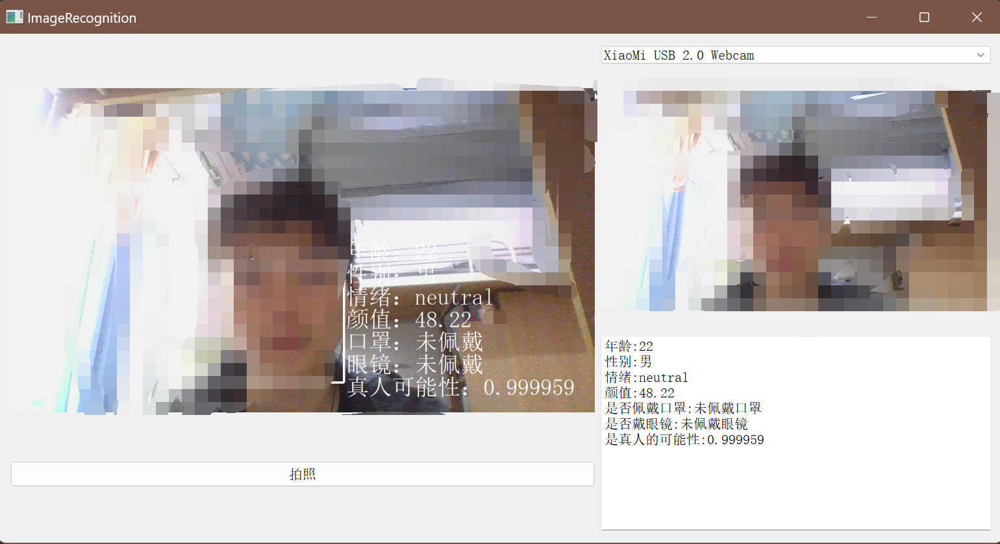

　　　　　　　　　　　　　　　　　                                                项目名称：Qt人脸识别与分析系统
项目概述（代码链接：GitHub - fufufu11/QT5-FacialDetection）

　　本项目是一款基于Qt5框架构建的人脸检测应用程序，支持多摄像头选择和用户友好的图形界面。系统集成了百度的人脸检测API，能够通过HTTPS协议安全地发送请求，并解析返回的JSON数据来获取人脸特征信息，如年龄、性别、情绪状态及是否佩戴口罩等。为确保高性能和稳定性，项目还采用了多线程技术优化图像处理流程。

主要功能
实时人脸检测：系统能够实时检测并识别来自多个摄像头输入的视频流中的人脸。
人脸属性分析：分析并展示检测到的人脸的详细属性信息。
高效图像处理：通过多线程技术优化了图像处理逻辑，确保在处理大量数据时系统的响应速度和稳定性。
技术细节
开发环境：Windows 11, Qt Creator 12.0.2, Qt 5.15.2 MinGW 64-bit,C++
网络通信：HTTPS
数据处理：JSON解析与Base64编码转换
并发处理：多线程技术
项目亮点
跨摄像头兼容性：支持多种摄像头设备，增强了系统的灵活性和实用性。
安全通信：实现了HTTPS请求的SSL配置，保障了数据传输的安全性。
性能优化：通过多线程技术显著提高了图像处理效率，解决了高负载下的系统卡顿问题。
解决的实际问题
　　在性能测试过程中，发现了由于大量图片处理导致的系统卡顿问题。通过详细的代码审查（白盒测试），定位到了问题根源在于Base64编码转换过程中消耗了过多的计算资源。为了解决这个问题，引入了多线程机制来分散处理任务，从而有效地减轻了单个线程的压力，并通过回归测试验证了方案的有效性。

使用效果

包含了检测年龄（仅供参考）、性别、情绪、颜值（仅供参考）、是否佩戴口罩、是否佩戴眼镜、真人可能性这几种检测项目
如果想添加其他的检测项目，可以参考百度人脸检测的相关文档https://cloud.baidu.com/doc/FACE/s/yk37c1u4t

